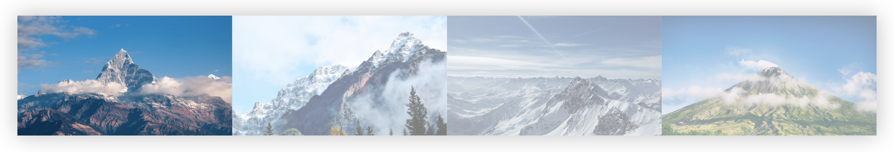
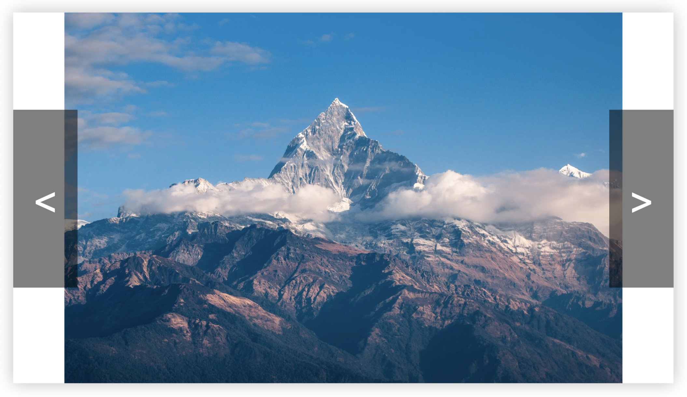
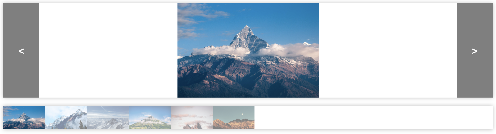
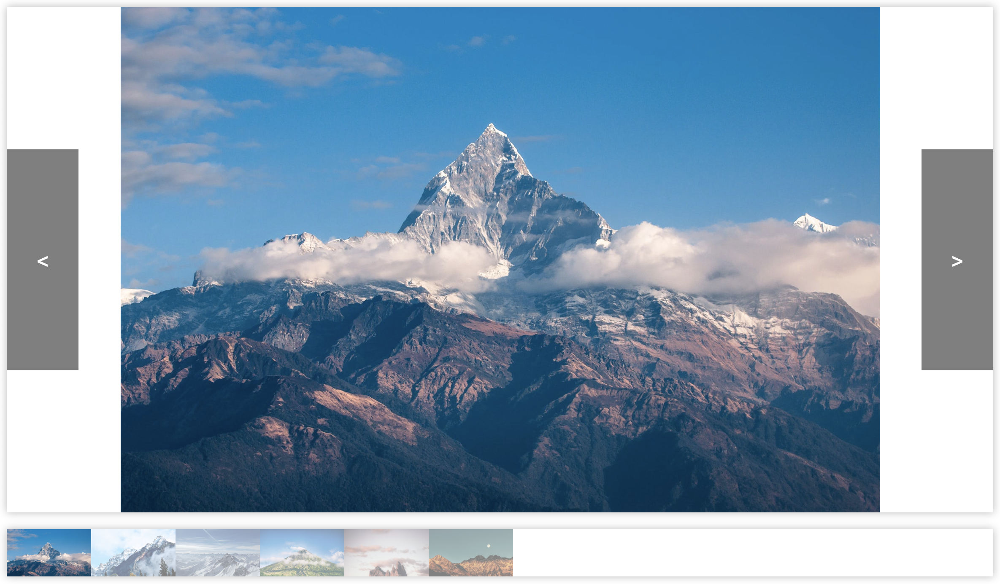

# Slideoscope

Slideoscope is a lightweight and minimalist slideshow plugin built with vanilla JavaScript and CSS.

### CDN
Include these two tags in the head of your HTML page.
```
    <!-- CSS -->
    <link rel="stylesheet" href="https://cdn.jsdelivr.net/npm/slideoscope@1.0.1/main.css">

    <!-- JavaScript -->
    <script src="https://cdn.jsdelivr.net/npm/slideoscope@1.0.1/app.js"></script>
```

### Boilerplate

```
<!-- Slideoscope container -->
<div class="slideoscope">
    <div class="slideoscope-screen-container">
        <!-- Screen (big image) -->
        <div class="slideoscope-screen"></div>
        <!-- Back and next buttons -->
        <button class="slideoscope-back"><</button>
        <button class="slideoscope-next">></button>
    </div>
    <!-- Queue of slides -->
    <div class="slideoscope-queue">
        <!-- Slides -->
        <div class="slideoscope-slide" data-src="https://images.pexels.com/photos/417173/pexels-photo-417173.jpeg?auto=compress&cs=tinysrgb&dpr=2&h=750&w=1260"></div>
        <div class="slideoscope-slide" data-src="https://images.pexels.com/photos/291732/pexels-photo-291732.jpeg?auto=compress&cs=tinysrgb&dpr=2&h=750&w=1260"></div>
        <div class="slideoscope-slide" data-src="https://images.pexels.com/photos/355241/pexels-photo-355241.jpeg?auto=compress&cs=tinysrgb&dpr=2&h=750&w=1260"></div>
        <div class="slideoscope-slide" data-src="https://images.pexels.com/photos/913215/pexels-photo-913215.jpeg?auto=compress&cs=tinysrgb&dpr=2&h=750&w=1260"></div>
        <div class="slideoscope-slide" data-src="https://images.pexels.com/photos/1670187/pexels-photo-1670187.jpeg?auto=compress&cs=tinysrgb&dpr=2&h=750&w=1260"></div>
        <div class="slideoscope-slide" data-src="https://images.pexels.com/photos/673020/pexels-photo-673020.jpeg?auto=compress&cs=tinysrgb&dpr=2&h=750&w=1260"></div>
    </div>
</div>
```

## Customization

### Change source of slide images

```
<div class="slideoscope-slide" data-src="https://images.pexels.com/photos/417173/pexels-photo-417173.jpeg?auto=compress&cs=tinysrgb&dpr=2&h=750&w=1260"></div>
```

To ensure that all images in a slideshow are displayed with the same height, slideoscope does not use `````` tags. Instead, the image source is specified using the HTML ```data-*``` attribute. Whatevever URL is provided in the ```data-src``` attribute is displayed as the background image of that slide div or screen div.



For slides shown in the queue, images are displayed with ```background-size: cover;```



For slides shown on the screen (big image), images are displayed with ```background-size: contain;```

### Change the size of the screen (big image)

The screen's width is ```100%``` of the slideoscope's width. By default, the width of a slideoscope is ```400px```. If you would like to change the width of the screen, select the ```.slideoscope``` class and change the ```width``` property to a value of your choosing. Just make sure that your custom CSS is applied after the default Slideoscope CSS from the CDN.

```
.slideoscope {
    width: 100%;
}
```

Or you may apply an inline style to the specific slideoscope that you would like to change.

```<div style="width: 100%" class="slideoscope">```



As you can see, the slideoscope is wider and the screen is wider but the screen is not taller and therefore the image appears to be the same size as before. The height of the screen is ```100%``` of the ```slideoscope-screen-container``` div. By default, the ```slideoscope-screen-container``` height is ```225px```. To change the height of the screen, select the ```.slideoscope-screen-container``` class and change the ```height``` property to a value of your choosing. Again, make sure that your custom CSS is applied after the default Slideoscope CSS from the CDN.

```
.slideoscope-screen-container {
    height: 600px;
}
```

Or you may apply an inline style to the specific slideoscope that you would like to change.

```<div style="height: 600px;" class="slideoscope-screen-container">```



## Authors

* **Joe Hinkley** - [joehinkley.com](https://joehinkley.com/)

## License

This project is licensed under the MIT License - see the [LICENSE.md](LICENSE.md) file for details
